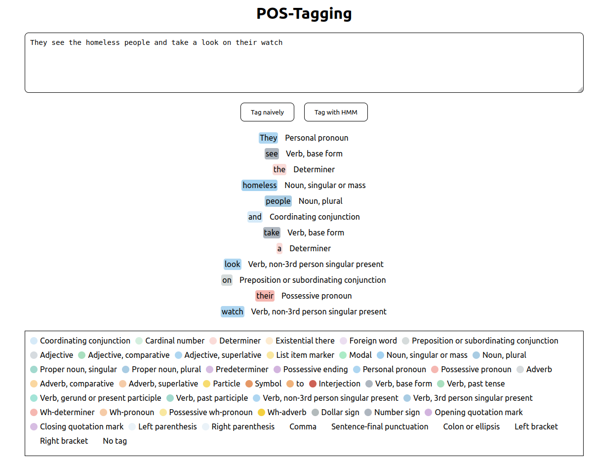
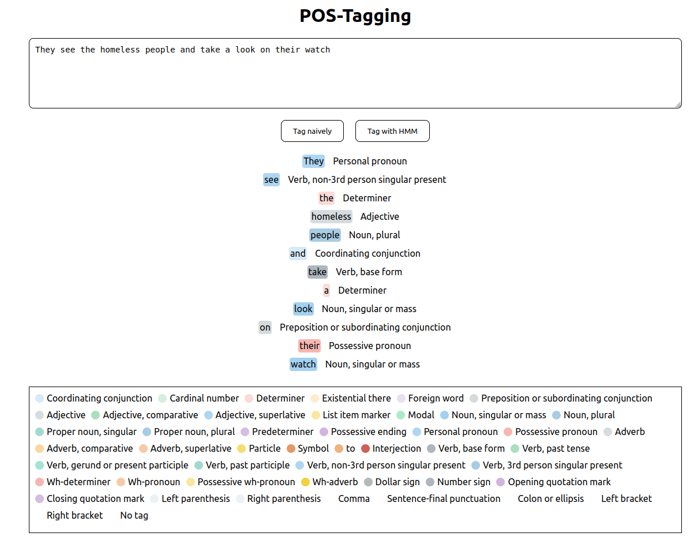
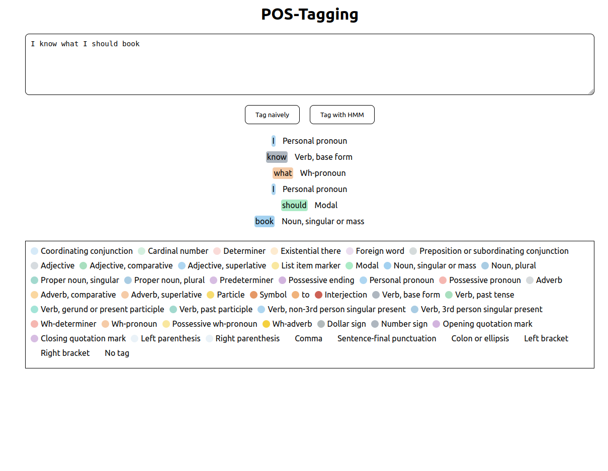
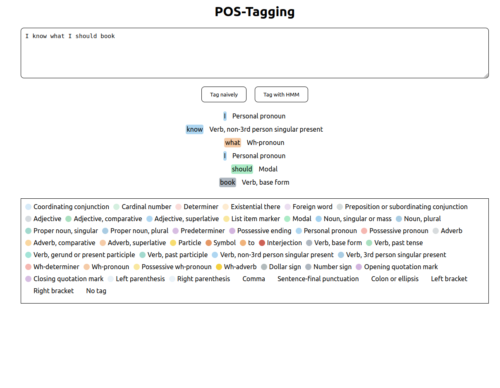
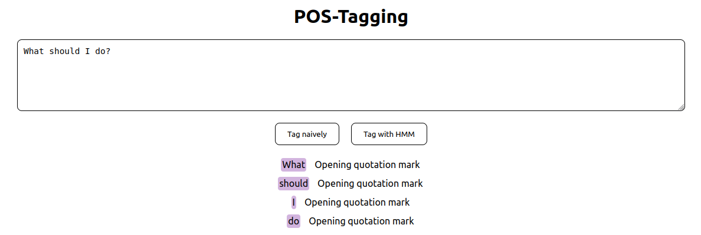
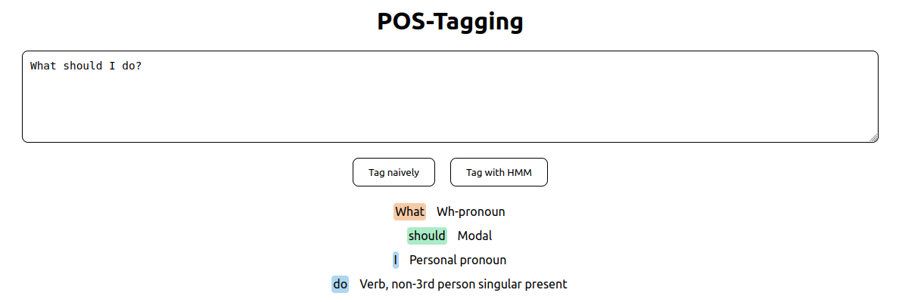
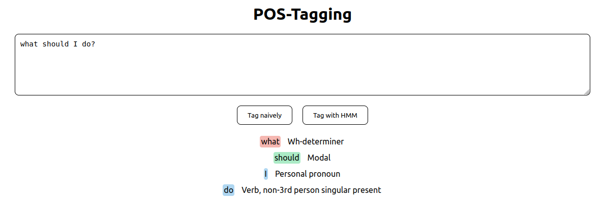

# Part of Speech Tagging

## Overview
This project focuses on the implementation and comparison of two different approaches to Part of Speech (POS) tagging: Naive POS Tagging and POS Tagging using Hidden Markov Models (HMMs) with the Viterbi algorithm. Our dataset of choice is the UPenn Treebank dataset, which contains 46 different POS categories.

### Naive POS Tagging
In the Naive POS Tagging approach, each word in a sentence is tagged independently based on the most likely tag for that word. This method looks up each word in a pre-compiled frequency table to find its most likely tag. However, this approach has its limitations. For instance, it cannot effectively disambiguate between words that can have multiple POS tags based on context, such as "watch" (which can be a noun or a verb).

### POS Tagging with HMMs
On the other hand, POS Tagging using HMMs leverages the Viterbi algorithm, which considers the context of each word by maintaining a hidden state. This context-aware approach allows for more accurate tagging, especially in cases where words have multiple possible tags.

#### Viterbi Algorithm
The Viterbi algorithm is a dynamic programming algorithm used for finding the most probable sequence of hidden states – called the Viterbi path – that results in a sequence of observed events. More details can be found in the [Wikipedia article on the Viterbi algorithm](https://en.wikipedia.org/wiki/Viterbi_algorithm).

#### Part of Speech Tagging
For a broader understanding of POS tagging, refer to the [Wikipedia article on Part of Speech Tagging](https://en.wikipedia.org/wiki/Part-of-speech_tagging).

## Examples

### Naive vs HMM Tagging
The effectiveness of both approaches can be compared through the following examples, where we see how each method tags the same sentences:

- Naive Tagging Example 1:
  

- HMM Tagging Example 1:
  

- Naive Tagging Example 2:
  

- HMM Tagging Example 2:
  

### Failure Case for HMM Tagging
Despite its advantages, the HMM approach is not foolproof. Consider this failure case where HMM tagging does not yield the correct result:

- HMM Failure Case:
  

- Naive Non-Failure Case:
  

In this case, the error is induced by capitalization. Changing "W" to "w" resolves the issue:

- HMM Recovery Example:
  